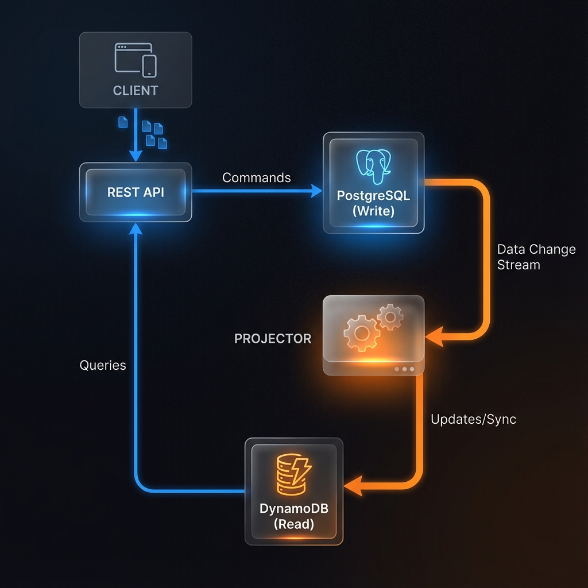

# Polyglot CQRS Order Service

A high-performance demonstration of **Command Query Responsibility Segregation (CQRS)** using a polyglot database architecture: **PostgreSQL** for transactional Writes and **AWS DynamoDB** for optimized, high-speed Reads.

---

## 🏗️ System Architecture



This project separates the application into two distinct paths:

1.  **The Command Side (Writes)**:
    *   **Database**: PostgreSQL (v15)
    *   **Responsibility**: Source of Truth. Handles transactional integrity via ACID compliance.
    *   **Flow**: Client -> REST API (POST) -> JPA/Hibernate -> PostgreSQL.

2.  **The Query Side (Reads)**:
    *   **Database**: AWS DynamoDB (Materialized View)
    *   **Responsibility**: Performance. Optimized for sub-millisecond lookups for user order history.
    *   **Flow**: Client -> REST API (GET) -> DynamoDB Enhanced Client -> DynamoDB.

3.  **The Synchronization (Projection)**:
    *   When an order is saved in PostgreSQL, an **OrderProjector** immediately transforms and replicates the data to DynamoDB. In a massive production environment, this is often handled by CDC (Change Data Capture) or the Outbox Pattern.

---

## 🚀 Getting Started

### 1. Prerequisites
- Docker & Docker Compose
- Java 17+
- Maven

### 2. Launch Infrastructure
Bring up PostgreSQL and DynamoDB Local:
```bash
docker-compose up -d
```

### 3. Run the Application
```bash
mvn spring-boot:run
```

---

## 🛠️ API Documentation

### Create an Order
**Endpoint**: `POST /api/orders`
```json
{
  "userId": "shivam_99",
  "amount": 499.50
}
```

### Fetch User Orders (Optimized Read)
**Endpoint**: `GET /api/orders/{userId}`
- This query hits **DynamoDB** and retrieves data instantly without expensive joins on the write database.

---

## 💡 Key Design Decisions

- **PostgreSQL**: Chosen for the "Write" side because orders require strict consistency and transactional safety.
- **DynamoDB**: Chosen for the "Read" side to support horizontal scaling and ultra-low latency queries as the dataset grows to millions of records.
- **Polyglot Storage**: Leveraging the right tool for the right job (Relational for transactions, NoSQL for high-speed queries).
